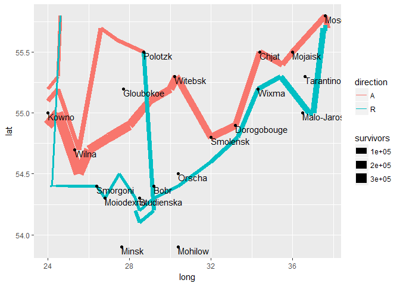

# Data Hierarchy
Ethel Ruan  
2017-02-11  


Compared to ggplot2, ggvis has a much richer data hierarchy. In ggplot2, you could define a data set and aesthetic mappings in the base plot, and override them in each layer, but since layers could not contain other layers, there were only ever two levels in the tree. ggvis is more flexible because ggvis nodes (the equivalent of ggplot2 layers) can contain child nodes. This makes it possible to have whatever level of hierarchy that is best suited to your plot.

This is also related to a confusion in ggplot2 where `geom` often were actually aliases for a geom + combination. For example:

  -  `geom_histogram` = `geom_bar` + `stat_bin`
  -  `geom_smooth` = `geom_smooth` + `stat_smooth`

In ggvis, there is a **clear demarkation** between **marks** (pure drawing) and **layers** (transformation + drawing). The low-level functions for drawing a mark start with `emit_`, and then the type of mark. For example:

 - `layer_histograms` = `compute_bin` + `emit_rects`
 -  `layer_smooths` = `layer_model_predictions` + (`emit_paths` + `emit_ribbons`)

ggplot2 needed special geoms like `geom_smooth` because the data hierarchy was not deep enough, and there was no standard way for a stat to take the output of another stat as it’s input, and no way for a stat to feed data to multiple layers without either creating a custom geom or duplicating the stat multiple times.

#Data pipeline

A ggvis specification creates a data pipeline that flows from the starting node to all of the leaves (marks).

#Combining props

In ggplot2, layers had an `inherit.aes` property which control whether or not a layer would inherit properties from the parent dataset - this is particularly useful when writing functions that add annotation to arbitrary plots - you don’t want other properties that the user set interfering with your layer. In ggvis, that’s now a property of `props()`: `props(inherit = FALSE)`.

To see how ggvis combines properties, you can use the `merge_props` function:
```
merge_props <- ggvis:::merge_props
merge_props(props(x = ~x), props(y = ~y))

```
```
merge_props(props(x = ~a), props(x = ~b))

```
```
merge_props(props(x = ~a, y = ~a), props(x = ~b, inherit = FALSE))

```
There is currently no way to remove a prop inherited from the parent. See <https://github.com/rstudio/ggvis/issues/37> for progress.

#Case studies
##Minard’s march

```r
library(ggplot2)
```

```
## Warning: package 'ggplot2' was built under R version 3.3.2
```

```r
library(HistData)
```

```
## Warning: package 'HistData' was built under R version 3.3.2
```

```r
data(Minard.troops)
data(Minard.cities)
data(Minard.temp)

ggplot(Minard.cities, aes(x = long, y = lat)) +
  geom_path(
    aes(size = survivors, colour = direction, group = group),
    data = Minard.troops
  ) +
  geom_point() +
  geom_text(aes(label = city), hjust=0, vjust=1, size=4)
```

<!-- -->
In ggvis, we can make it a little more clear that we have one marked based on survivors dataset and two marks based on the cities dataset.

```r
library(ggvis)
```

```
## Warning: package 'ggvis' was built under R version 3.3.2
```

```
## 
## Attaching package: 'ggvis'
```

```
## The following object is masked from 'package:ggplot2':
## 
##     resolution
```

```r
ggvis(data = NULL, x = ~long, y = ~lat) %>%
  layer_points(size = ~survivors, stroke = ~direction, data = Minard.troops) %>%
  layer_text(text := ~city, dx := 5, dy := -5, data = Minard.cities)
```

<!--html_preserve--><div id="plot_id713183625-container" class="ggvis-output-container">
<div id="plot_id713183625" class="ggvis-output"></div>
<div class="plot-gear-icon">
<nav class="ggvis-control">
<a class="ggvis-dropdown-toggle" title="Controls" onclick="return false;"></a>
<ul class="ggvis-dropdown">
<li>
Renderer: 
<a id="plot_id713183625_renderer_svg" class="ggvis-renderer-button" onclick="return false;" data-plot-id="plot_id713183625" data-renderer="svg">SVG</a>
 | 
<a id="plot_id713183625_renderer_canvas" class="ggvis-renderer-button" onclick="return false;" data-plot-id="plot_id713183625" data-renderer="canvas">Canvas</a>
</li>
<li>
<a id="plot_id713183625_download" class="ggvis-download" data-plot-id="plot_id713183625">Download</a>
</li>
</ul>
</nav>
</div>
</div>
<script type="text/javascript">
var plot_id713183625_spec = {
  "data": [
    {
      "name": "Minard.cities1",
      "format": {
        "type": "csv",
        "parse": {
          "long": "number",
          "lat": "number"
        }
      },
      "values": "\"long\",\"lat\",\"city\"\n24,55,\"Kowno\"\n25.3,54.7,\"Wilna\"\n26.4,54.4,\"Smorgoni\"\n26.8,54.3,\"Moiodexno\"\n27.7,55.2,\"Gloubokoe\"\n27.6,53.9,\"Minsk\"\n28.5,54.3,\"Studienska\"\n28.7,55.5,\"Polotzk\"\n29.2,54.4,\"Bobr\"\n30.2,55.3,\"Witebsk\"\n30.4,54.5,\"Orscha\"\n30.4,53.9,\"Mohilow\"\n32,54.8,\"Smolensk\"\n33.2,54.9,\"Dorogobouge\"\n34.3,55.2,\"Wixma\"\n34.4,55.5,\"Chjat\"\n36,55.5,\"Mojaisk\"\n37.6,55.8,\"Moscou\"\n36.6,55.3,\"Tarantino\"\n36.5,55,\"Malo-Jarosewii\""
    },
    {
      "name": "Minard.troops0",
      "format": {
        "type": "csv",
        "parse": {
          "long": "number",
          "lat": "number",
          "survivors": "number"
        }
      },
      "values": "\"long\",\"lat\",\"survivors\",\"direction\"\n24,54.9,340000,\"A\"\n24.5,55,340000,\"A\"\n25.5,54.5,340000,\"A\"\n26,54.7,320000,\"A\"\n27,54.8,300000,\"A\"\n28,54.9,280000,\"A\"\n28.5,55,240000,\"A\"\n29,55.1,210000,\"A\"\n30,55.2,180000,\"A\"\n30.3,55.3,175000,\"A\"\n32,54.8,145000,\"A\"\n33.2,54.9,140000,\"A\"\n34.4,55.5,127100,\"A\"\n35.5,55.4,100000,\"A\"\n36,55.5,100000,\"A\"\n37.6,55.8,100000,\"A\"\n37.7,55.7,100000,\"R\"\n37.5,55.7,98000,\"R\"\n37,55,97000,\"R\"\n36.8,55,96000,\"R\"\n35.4,55.3,87000,\"R\"\n34.3,55.2,55000,\"R\"\n33.3,54.8,37000,\"R\"\n32,54.6,24000,\"R\"\n30.4,54.4,20000,\"R\"\n29.2,54.3,20000,\"R\"\n28.5,54.2,20000,\"R\"\n28.3,54.3,20000,\"R\"\n27.5,54.5,20000,\"R\"\n26.8,54.3,12000,\"R\"\n26.4,54.4,14000,\"R\"\n25,54.4,8000,\"R\"\n24.4,54.4,4000,\"R\"\n24.2,54.4,4000,\"R\"\n24.1,54.4,4000,\"R\"\n24,55.1,60000,\"A\"\n24.5,55.2,60000,\"A\"\n25.5,54.7,60000,\"A\"\n26.6,55.7,40000,\"A\"\n27.4,55.6,33000,\"A\"\n28.7,55.5,33000,\"A\"\n28.7,55.5,33000,\"R\"\n29.2,54.2,30000,\"R\"\n28.5,54.1,30000,\"R\"\n28.3,54.2,28000,\"R\"\n24,55.2,22000,\"A\"\n24.5,55.3,22000,\"A\"\n24.6,55.8,6000,\"A\"\n24.6,55.8,6000,\"R\"\n24.2,54.4,6000,\"R\"\n24.1,54.4,6000,\"R\""
    },
    {
      "name": "scale/size",
      "format": {
        "type": "csv",
        "parse": {
          "domain": "number"
        }
      },
      "values": "\"domain\"\n4000\n340000"
    },
    {
      "name": "scale/stroke",
      "format": {
        "type": "csv",
        "parse": {}
      },
      "values": "\"domain\"\n\"A\"\n\"R\""
    },
    {
      "name": "scale/x",
      "format": {
        "type": "csv",
        "parse": {
          "domain": "number"
        }
      },
      "values": "\"domain\"\n23.315\n38.385"
    },
    {
      "name": "scale/y",
      "format": {
        "type": "csv",
        "parse": {
          "domain": "number"
        }
      },
      "values": "\"domain\"\n53.805\n55.895"
    }
  ],
  "scales": [
    {
      "name": "size",
      "domain": {
        "data": "scale/size",
        "field": "data.domain"
      },
      "zero": false,
      "nice": false,
      "clamp": false,
      "range": [20, 100]
    },
    {
      "name": "stroke",
      "type": "ordinal",
      "domain": {
        "data": "scale/stroke",
        "field": "data.domain"
      },
      "points": true,
      "sort": false,
      "range": "category10"
    },
    {
      "name": "x",
      "domain": {
        "data": "scale/x",
        "field": "data.domain"
      },
      "zero": false,
      "nice": false,
      "clamp": false,
      "range": "width"
    },
    {
      "name": "y",
      "domain": {
        "data": "scale/y",
        "field": "data.domain"
      },
      "zero": false,
      "nice": false,
      "clamp": false,
      "range": "height"
    }
  ],
  "marks": [
    {
      "type": "symbol",
      "properties": {
        "update": {
          "fill": {
            "value": "#000000"
          },
          "x": {
            "scale": "x",
            "field": "data.long"
          },
          "y": {
            "scale": "y",
            "field": "data.lat"
          },
          "size": {
            "scale": "size",
            "field": "data.survivors"
          },
          "stroke": {
            "scale": "stroke",
            "field": "data.direction"
          }
        },
        "ggvis": {
          "data": {
            "value": "Minard.troops0"
          }
        }
      },
      "from": {
        "data": "Minard.troops0"
      }
    },
    {
      "type": "text",
      "properties": {
        "update": {
          "fill": {
            "value": "#333333"
          },
          "x": {
            "scale": "x",
            "field": "data.long"
          },
          "y": {
            "scale": "y",
            "field": "data.lat"
          },
          "text": {
            "field": "data.city"
          },
          "dx": {
            "value": 5
          },
          "dy": {
            "value": -5
          }
        },
        "ggvis": {
          "data": {
            "value": "Minard.cities1"
          }
        }
      },
      "from": {
        "data": "Minard.cities1"
      }
    }
  ],
  "legends": [
    {
      "orient": "right",
      "size": "size",
      "title": "survivors"
    },
    {
      "orient": "right",
      "stroke": "stroke",
      "title": "direction"
    }
  ],
  "axes": [
    {
      "type": "x",
      "scale": "x",
      "orient": "bottom",
      "layer": "back",
      "grid": true,
      "title": "long"
    },
    {
      "type": "y",
      "scale": "y",
      "orient": "left",
      "layer": "back",
      "grid": true,
      "title": "lat"
    }
  ],
  "padding": null,
  "ggvis_opts": {
    "keep_aspect": false,
    "resizable": true,
    "padding": {},
    "duration": 250,
    "renderer": "svg",
    "hover_duration": 0,
    "width": 672,
    "height": 480
  },
  "handlers": null
};
ggvis.getPlot("plot_id713183625").parseSpec(plot_id713183625_spec);
</script><!--/html_preserve-->
